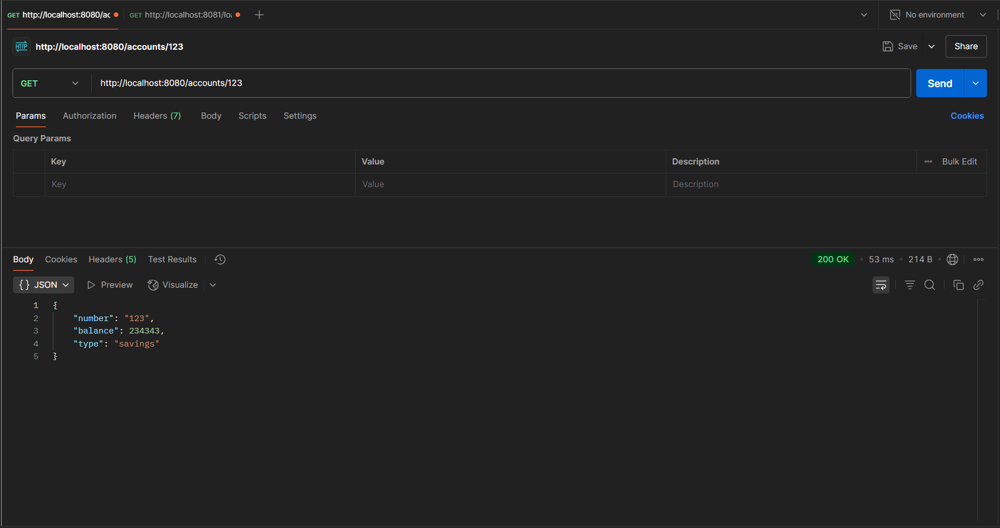
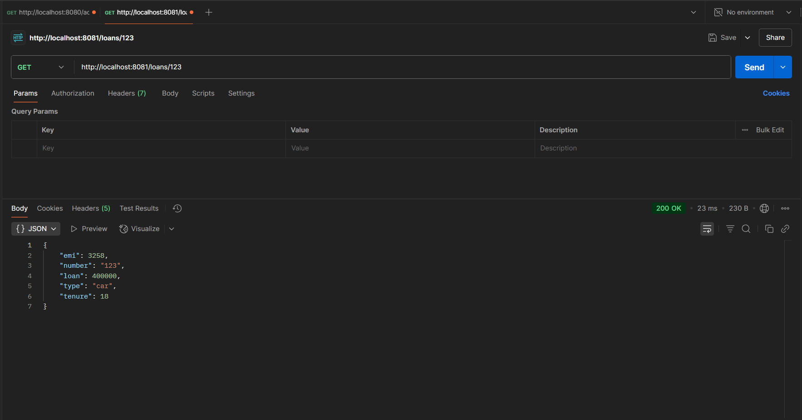

Creating Microservices for account and loan

In this hands on exercises, we will create two microservices for a bank. 
One microservice for handing accounts and one for handling loans.
Each microservice will be a specific independent Spring RESTful Webservice
maven project having it's own pom.xml. The only difference is that, instead of
having both account and loan as a single application, it is split into two
different applications. These webservices will be a simple service without any
backend connectivity.

Follow steps below to implement the two microservices:

Account Microservice

 Create folder with employee id in D: drive

 Create folder named 'microservices' in the new folder created in
previous step. This folder will contain all the sample projects that we will
create for learning microservices.

 Open https://start.spring.io/ in browser

 Enter form field values as specified below:

o Group: com.cognizant

o Artifact: account

 Select the following modules

o Developer Tools > Spring Boot DevTools

o Web > Spring Web

 Click generate and download the zip file

 Extract 'account' folder from the zip and place this folder in the
'microservices' folder created earlier

 Open command prompt in account folder and build using mvn clean
package command

 Import this project in Eclipse and implement a controller method for
getting account details based on account number. Refer specification
below:

o Method: GET

o Endpoint: /accounts/{number}

o Sample Response. Just a dummy response without any backend
connectivity.

    { number: "00987987973432", type: "savings", balance: 234343 }

 Launch by running the application class and test the service in browser
Loan Microservice

 Follow similar steps specified for Account Microservice and implement a
service API to get loan account details

o Method: GET

o Endpoint: /loans/{number}

o Sample Response. Just a dummy response without any backend
connectivity.
    
    { number: "H00987987972342", type: "car", loan: 400000, emi: 3258, tenure: 18 }

 Launching this application by having account service already running

 This launch will fail with error that the bind address is already in use

 The reason is that each one of the service is launched with default port
number as 8080. Account service is already using this port and it is not
available for loan service.

 Include "server.port" property with value 8081 and try launching the
application

 Test the service with 8081 port
Now we have two microservices running on different ports. 
