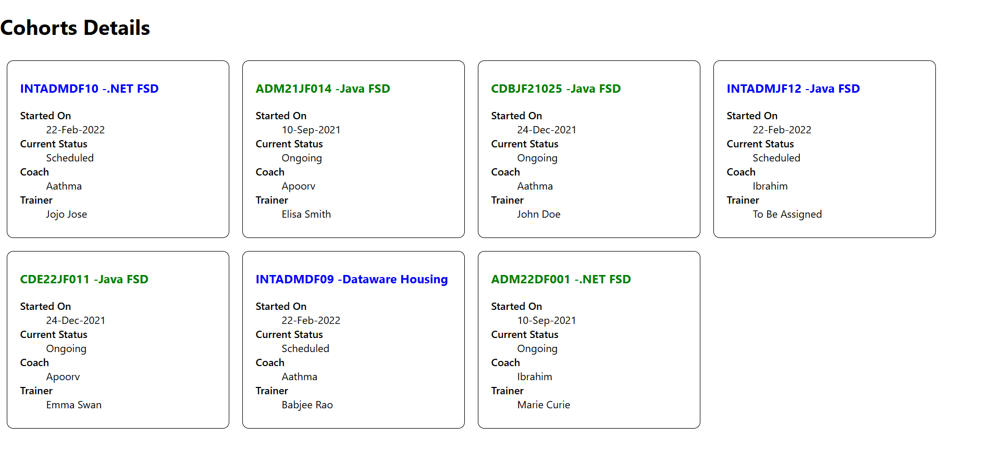

Objectives

•	Understanding the need for styling react component

•	Working with CSS Module and inline styles

In this hands-on lab, you will learn how to:

•	Style a react component

•	Define styles using the CSS Module

•	Apply styles to components using className and style properties

Prerequisites

The following is required to complete this hands-on lab:

•	Node.js

•	NPM

•	Visual Studio Code

Notes

Estimated time to complete this lab: 30 minutes.

My Academy team at Cognizant want to create a dashboard containing the details of ongoing and completed cohorts. A react application is created which displays the detail of the cohorts using react component. You are assigned the task of styling these react components.

1.	Unzip the react application in a folder
2.	Open command prompt and switch to the react application folder
3.	Restore the node packages
4.	Open the application using VS Code
5.	Create a new CSS Module in a file called “CohortDetails.module.css”
6.	Define a css class with the name as “box” with following properties
      Width = 300px;
      Display = inline block;
      Overall 10px margin
      Top and bottom padding as 10px
      Left and right padding as 20px
      1 px border in black color
      A border radius of 10px
7.	Define a css style for html <dt> element using tag selector. Set the font weight to 500.
8.	Open the cohort details component and import the CSS Module
9.	Apply the box class to the container div
10.	Define the style for <h3> element to use “green” color font when cohort status is “ongoing” and “blue” color in all other scenarios.